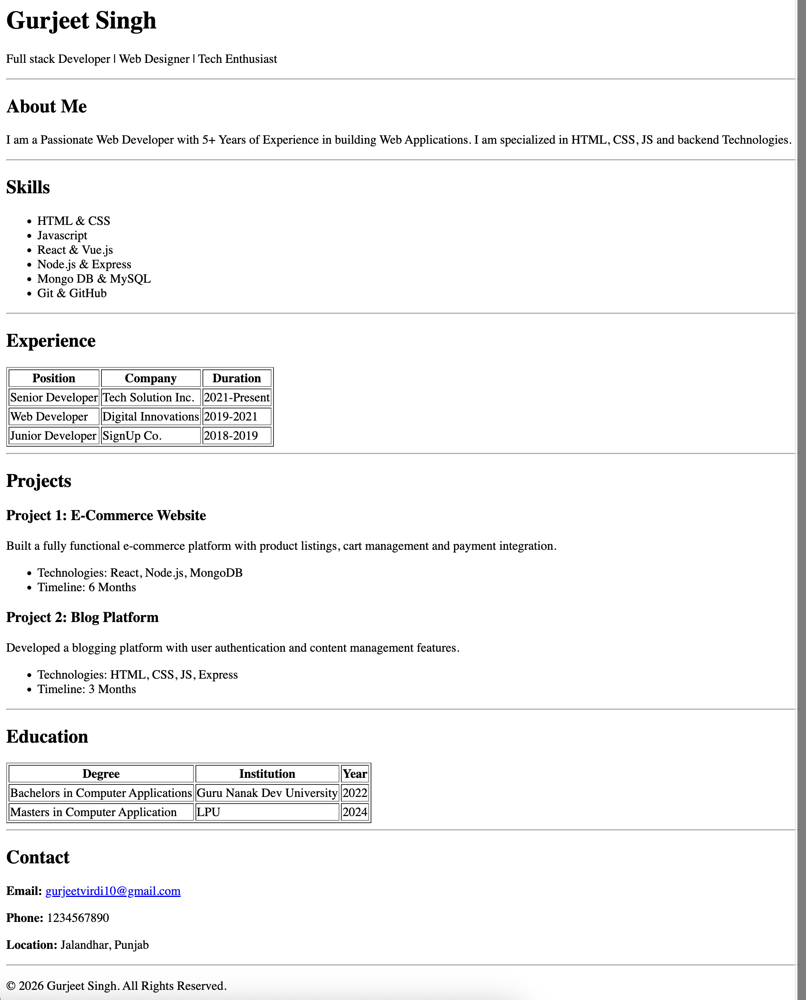

# HTML Resume Page Assignment

A semantic and accessible resume webpage built using **pure HTML**.

## 📸 Preview

Here's what the resume looks like:



---

## Project Overview

This project is a simple resume website created as part of an HTML learning assignment.  
The main focus is to practice **semantic HTML**, proper document structure, and clean markup without using CSS or JavaScript.

---

̦## Technologies Used

- HTML5
- Semantic HTML elements

> No CSS  
> No JavaScript  
> Pure HTML only

---

## Features

- Semantic structure using:
  - `<header>`
  - `<main>`
  - `<section>`
  - `<article>`
  - `<footer>`
- Proper heading hierarchy (`h1` → `h2` → `h3`)
- Skills listed using unordered lists
- Experience and education displayed using tables
- Contact information in the footer
- Clean, readable, and accessible HTML markup
 
---

## Project Structure

```text
.
├── index.html
└── README.md
```
---

##  How to Run Locally

Follow these simple steps to view the resume on your computer:

### Method 1: Using a Web Browser

1. **Open the file directly:**
   - Navigate to the project folder on your computer
   - Double-click on `index.html`
   - It will open in your default web browser

2. **Or drag and drop:**
   - Open your web browser (Chrome, Firefox, Safari, etc.)
   - Drag the `index.html` file into the browser window

### Method 2: Using a Local Server (Recommended for Learning)

**Using VS Code Live Server extension:**
- Install the **Live Server** extension in VS Code
- Right-click on `index.html`
- Select **Open with Live Server**

